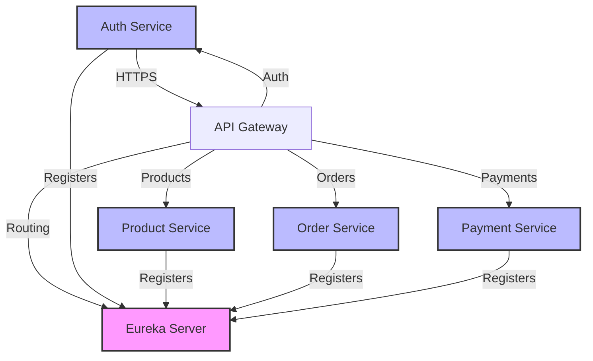
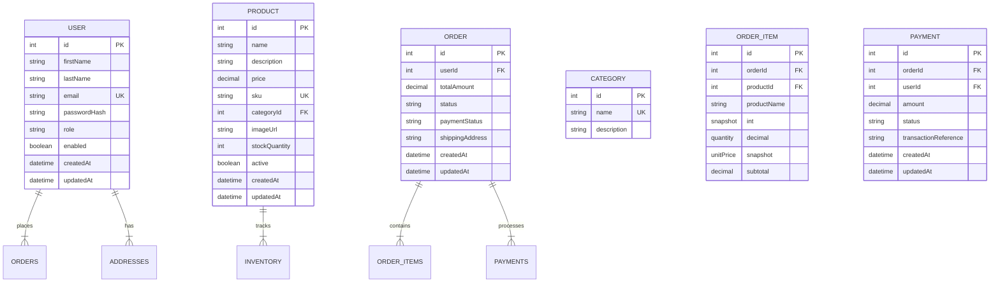

# ShopSphere - Full-Stack E-Commerce Microservices Platform

## Project Overview

ShopSphere is a modern, production-style e-commerce platform demonstrating enterprise-grade Java/Spring Boot microservices architecture with a React/TypeScript frontend. The platform is designed to showcase skills in:

- Java 21 & Spring Boot microservices
- Spring Cloud (Gateway, Security, Cloud Sleuth)
- REST API design with OpenAPI documentation
- PostgreSQL with Flyway migrations
- JWT authentication and RBAC
- Docker & Docker Compose
- GitHub Actions CI/CD
- Vercel deployment

The application is structured as independent microservices with clear boundaries, service discovery via Eureka, and API gateway routing.

## Features

### Customer Features
- Registration, login, logout with JWT authentication
- Product browsing with search, filtering, and sorting
- Shopping cart management
- Checkout with demo payment processing
- Order history and tracking
- Profile management

### Admin Features
- Dashboard with analytics
- Product management (CRUD, inventory, deactivation)
- Category management
- Order management with status updates
- User management

### Infrastructure
- Service discovery with Eureka Server
- API Gateway (Spring Cloud Gateway) with CORS
- Centralized error handling
- Actuator health monitoring
- Docker containerization
- GitHub Actions CI/CD pipelines

## Architecture

The system follows a microservices architecture with the following layers:

```
                     SHOPSPHERE
                          |
                          |
                React + TypeScript
                     Vercel
                          |
                          ↓
                Spring Cloud Gateway
                          |
                          ↓
                Service Discovery
                     Eureka Server
                          |
      ┌───────────────────┼────────────────────┐
      ↓                   ↓                    ↓
Auth Service        Product Service       Order Service
Spring Boot         Spring Boot           Spring Boot
      ↓                   ↓                    │
auth_schema          product_schema         order_schema
      │                   │                    │
      └───────────────────┼────────────────────┘
                          ↓
                 Supabase PostgreSQL
                          |
                          |
                   Payment Service
                    Spring Boot
```

## Microservices

| Service | Responsibility |
|---------|---------------|
| `service-discovery` | Eureka Server for service registration and discovery |
| `api-gateway` | Spring Cloud Gateway with CORS and routing |
| `auth-service` | Authentication, authorization, JWT, user management |
| `product-service` | Product catalog, categories, inventory |
| `order-service` | Order management, cart, order lifecycle |
| `payment-service` | Demo payment processing (no real money) |
| `notification-service` | Optional: order/email notifications |

## Technology Stack

### Backend
- **Java**: 21 (LTS)
- **Spring Boot**: 3.2.x
- **Spring Cloud**: 2023.0.0
- **Spring Web**, **Spring Data JPA**
- **Hibernate**: ORM
- **Spring Security**: Authentication and authorization
- **JWT**: JSON Web Tokens for stateless auth
- **BCrypt**: Password hashing
- **Maven**: Build tool
- **Flyway**: Database migrations
- **OpenAPI/Swagger**: API documentation
- **Actuator**: Monitoring and health

### Database
- **PostgreSQL**: Primary database
- **Supabase**: Production PostgreSQL
- **Schemas**: auth_schema, product_schema, order_schema, payment_schema

### Frontend
- **React**: 18 with TypeScript
- **Vite**: Build tool and dev server
- **Tailwind CSS**: Styling
- **React Router**: Navigation
- **Lucide React**: Icons
- **React Hook Form**: Form management (optional)
- **Zod**: Schema validation (optional)

### DevOps
- **Git**: Version control
- **GitHub**: Remote repository
- **GitHub Actions**: CI/CD pipelines
- **Docker**: Containerization
- **Docker Compose**: Local development

## Database Design

Services own their data via separate PostgreSQL schemas:

| Schema | Tables |
|--------|--------|
| `auth_schema` | users, addresses |
| `product_schema` | products, categories, inventory |
| `order_schema` | orders, order_items, carts, cart_items |
| `payment_schema` | payments |

### Key Design Principles
- Each service owns its tables (no cross-service DB access)
- Foreign keys where appropriate within a service's schema
- Unique constraints on email, username, SKU
- Indexes on frequently queried columns
- `created_at`, `updated_at` timestamps on all tables
- Soft deletes where appropriate (using `active` flag)

## API Design

RESTful endpoints follow conventional patterns:

```
GET    /api/products        - List products with pagination
POST   /api/products        - Create product (ADMIN)
GET    /api/products/{id}   - Get product by ID
PUT    /api/products/{id}   - Update product (ADMIN)
DELETE /api/products/{id}   - Delete product (ADMIN)
PATCH  /api/products/{id}/inventory - Update stock (ADMIN)

GET    /api/auth/login      - Login
POST   /api/auth/register   - Register
GET    /api/auth/me         - Current user
PUT    /api/auth/profile    - Update profile

POST   /api/orders          - Create order
GET    /api/orders          - List user orders
GET    /api/orders/{id}     - Get order details
PATCH  /api/orders/{id}/cancel - Cancel order
PATCH  /api/orders/{id}/status - Update order status (ADMIN)

POST   /api/payments        - Create payment
GET    /api/payments/{id}   - Get payment status
```

## Local Development

### Prerequisites
- Java 21 JDK
- Maven 3.8+
- Node.js 18+ & npm
- Docker & Docker Compose
- PostgreSQL (or Supabase account)

### Getting Started

1. **Start infrastructure services**:
   ```bash
   docker-compose up -d
   ```

2. **Start Eureka Server** and other services

3. **Run frontend** with Vite:
   ```bash
   cd frontend && npm install && npm run dev
   ```

4. **Access the application**:
   - Frontend: http://localhost:5173
   - Eureka: http://localhost:8761
   - API Gateway: http://localhost:8080

### Environment Variables

Create `.env` files from `.env.example`:

```
# Database
DATABASE_URL=jdbc:postgresql://localhost:5432/shopsphere
DATABASE_USERNAME=shopsphere
DATABASE_PASSWORD=secret

# JWT
JWT_SECRET=your-256-bit-secret-key-here

# Services
EUREKA_SERVER_URL=http://localhost:8761/eureka
FRONTEND_URL=http://localhost:5173

# Service URLs (auto-discovered via Eureka)
AUTH_SERVICE_URL=http://auth-service:8081
PRODUCT_SERVICE_URL=http://product-service:8082
ORDER_SERVICE_URL=http://order-service:8083
PAYMENT_SERVICE_URL=http://payment-service:8084
```

## CI/CD

### GitHub Actions

Two workflows handle CI:

- `.github/workflows/backend-ci.yml`: Maven build, tests, verification
- `.github/workflows/frontend-ci.yml`: npm install, typecheck, lint, tests, build

### Deployment

- **Frontend**: Deployable to Vercel via GitHub integration
- **Backend**: Deployable to any Docker-supported platform
- Each service is independently deployable

## Docker

Docker Compose orchestrates local development:

```yaml
version: '3.8'
services:
  eureka-server:
    image: shopsphere/eureka:latest
    ports:
      - "8761:8761"
  
  postgres:
    image: postgres:15
    environment:
      POSTGRES_DB: shopsphere
      POSTGRES_USER: shopsphere
      POSTGRES_PASSWORD: secret
    ports:
      - "5432:5432"
  
  # Services register with Eureka automatically
  auth-service:
    image: shopsphere/auth:latest
    depends_on:
      - eureka-server
      - postgres
  
  # ... other services
```

## Testing

### Backend
- JUnit 5 + Mockito for unit/integration tests
- Test coverage for auth, products, orders, payments
- Spring Boot Test with embedded server

### Frontend
- Vitest + React Testing Library
- Component tests for cart, checkout, product rendering
- Accessibility tests

## Deployment

### Vercel (Frontend)
1. Connect GitHub repo to Vercel
2. Set environment variable `VITE_API_BASE_URL`
3. Build: `npm run build`
4. Automatic deployments on push to main

### Backend (Free Options)
- **Railway**: Free tier, auto-deploys from GitHub
- **Render**: Free tier, web services
- **Fly.io**: Limited free tier
- Each service as separate Docker container

**Note**: Free tiers may have sleep triggers after inactivity.

## API Documentation

Full OpenAPI/Swagger documentation available at:
- `http://localhost:8080/swagger-ui.html` (via API Gateway)
- `http://localhost:8081/swagger-ui.html` (Auth Service)
- etc.

## Architecture Diagrams





## Development Roadmap

### Phase 1: Architecture & Foundation
- Repository structure
- Database design with schemas
- Service responsibilities
- Technology version selection
- Implementation plan

### Phase 2: Service Discovery & API Gateway
- Eureka Server setup
- Spring Cloud Gateway configuration
- CORS and routing

### Phase 3: Auth Service
- User registration & login
- JWT authentication
- BCrypt password hashing
- Spring Security configuration

### Phase 4: Product Service
- Product CRUD operations
- Category management
- Search, filtering, sorting
- Pagination

### Phase 5: Order & Cart Service
- Cart management
- Order creation
- Order lifecycle
- Inventory validation

### Phase 6: Payment Service
- Demo payment processing
- Payment status tracking
- Idempotency

### Phase 7-10: Frontend Development
- Design system
- Navbar, layout, homepage
- Product listing and details
- Cart, checkout, payment
- Order success, tracking
- Admin dashboard

### Phase 11: Integration
- Inter-service communication
- End-to-end flows

### Phase 12: Testing
- Backend: JUnit, Mockito
- Frontend: Vitest, RTL

### Phase 13: Docker & Deployment
- Dockerfiles for all services
- docker-compose.yml
- GitHub Actions CI/CD

### Phase 14: Documentation
- README updates
- Architecture diagrams
- API docs


