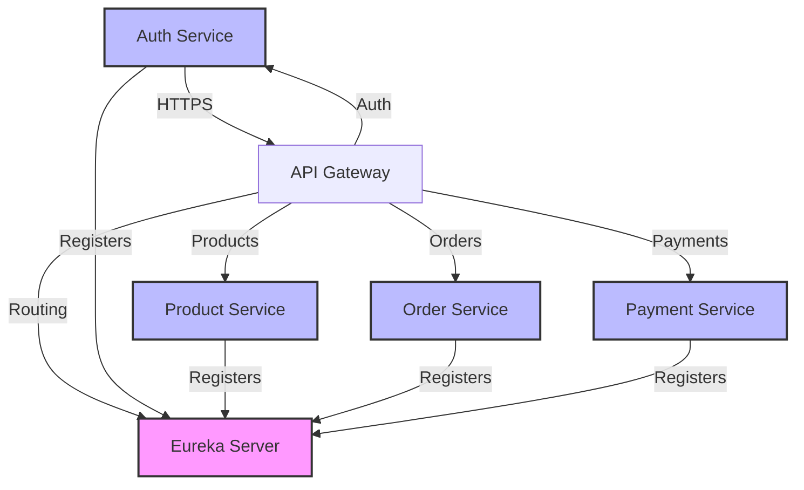
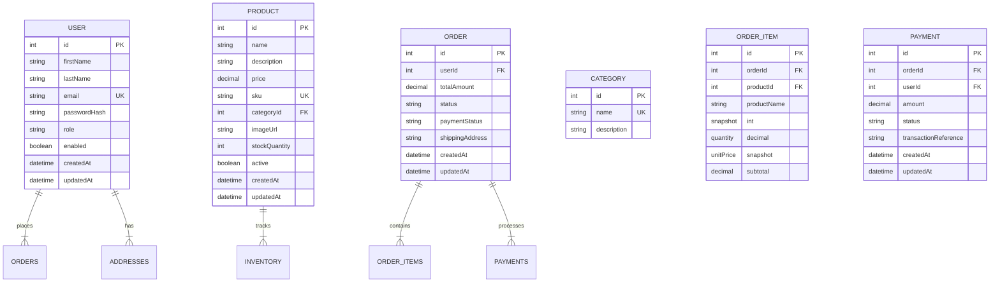

# ShopSphere Architecture

## Overview

ShopSphere is a modern e-commerce platform built using a microservices architecture with Spring Boot on the backend and React/TypeScript on the frontend. The system is designed to be scalable, maintainable, and production-ready.

## High-Level Architecture

```
                     SHOPSPHERE
                          |
                          |
                React + TypeScript
                     Vercel
                          |
                          ↓
                Spring Cloud Gateway
                          |
                          ↓
                Service Discovery
                     Eureka Server
                          |
      ┌───────────────────┼────────────────────┐
      ↓                   ↓                    ↓
Auth Service        Product Service       Order Service
Spring Boot         Spring Boot           Spring Boot
      ↓                   ↓                    │
auth_schema          product_schema         order_schema
      │                   │                    │
      └───────────────────┼────────────────────┘
                          ↓
                 Supabase PostgreSQL
                          |
                          |
                   Payment Service
                    Spring Boot
```

## Microservices

### 1. service-discovery (Eureka Server)
- **Port**: 8761
- **Responsibility**: Service registration and discovery
- **Features**: Eureka Server, self-registration, service metadata

### 2. api-gateway (Spring Cloud Gateway)
- **Port**: 8080
- **Responsibility**: Request routing, CORS, logging, rate limiting
- **Features**: Route predicates, filters, circuit breaker, centralized error handling

### 3. auth-service
- **Port**: 8081
- **Responsibility**: Authentication, authorization, user management
- **Features**: JWT authentication, BCrypt password hashing, RBAC, profile management

### 4. product-service
- **Port**: 8082
- **Responsibility**: Product catalog, categories, inventory
- **Features**: Product CRUD, search/filter/sort, pagination, category management

### 5. order-service
- **Port**: 8083
- **Responsibility**: Order management, cart, order lifecycle
- **Features**: Cart management, order creation, order tracking, state transitions

### 6. payment-service
- **Port**: 8084
- **Responsibility**: Demo payment processing
- **Features**: Idempotent payments, payment status tracking, demo card validation

### 7. notification-service (Optional)
- **Responsibility**: Order/email notifications
- **Features**: Order confirmation, payment confirmation, shipment updates

## Technology Stack

### Backend
- **Java**: 21 (LTS)
- **Spring Boot**: 3.2.x
- **Spring Cloud**: 2023.0.0
- **Spring Web**, **Spring Data JPA**, **Hibernate**
- **Spring Security**: Authentication and authorization
- **JWT**: JSON Web Tokens for stateless authentication
- **BCrypt**: Password hashing
- **Maven**: Build tool
- **Flyway**: Database migrations
- **OpenAPI/Swagger**: API documentation
- **Actuator**: Monitoring and health

### Database
- **PostgreSQL**: Primary database
- **Supabase**: Production PostgreSQL
- **Schemas**: auth_schema, product_schema, order_schema, payment_schema

### Frontend
- **React**: 18 with TypeScript
- **Vite**: Build tool and dev server
- **Tailwind CSS**: Styling
- **React Router**: Navigation
- **Lucide React**: Icons

### DevOps
- **Git**: Version control
- **GitHub**: Remote repository
- **GitHub Actions**: CI/CD pipelines
- **Docker**: Containerization
- **Docker Compose**: Local development

## Database Design

Each service owns its data via separate PostgreSQL schemas:

| Schema | Tables |
|--------|--------|
| `auth_schema` | users, addresses |
| `product_schema` | products, categories, inventory |
| `order_schema` | orders, order_items, carts, cart_items |
| `payment_schema` | payments |

### Key Design Principles
- Each service owns its tables (no cross-service DB access)
- Foreign keys where appropriate within a service's schema
- Unique constraints on email, username, SKU
- Indexes on frequently queried columns
- `created_at`, `updated_at` timestamps on all tables
- Soft deletes using `active` flag where appropriate

## API Design

RESTful endpoints follow conventional patterns:

```
# Auth
POST   /api/auth/register
POST   /api/auth/login
GET    /api/auth/me
PUT    /api/auth/profile

# Products
GET    /api/products
GET    /api/products/{id}
POST   /api/products
PUT    /api/products/{id}
DELETE /api/products/{id}
PATCH  /api/products/{id}/inventory

# Categories
GET    /api/categories

# Cart
GET    /api/cart
POST   /api/cart/items
PATCH  /api/cart/items/{productId}
DELETE /api/cart/items/{productId}
DELETE /api/cart

# Orders
POST   /api/orders
GET    /api/orders
GET    /api/orders/{id}
PATCH  /api/orders/{id}/cancel

# Payments
POST   /api/payments
GET    /api/payments/{paymentId}
GET    /api/payments/order/{orderId}
```

## Service Communication

### Intra-Service Communication
- **Order Service → Product Service**: For product/stock validation using OpenFeign
- **Order Service → Payment Service**: For payment processing using OpenFeign
- **No direct database coupling between services**

### API Gateway Pattern
- All external requests flow through the API Gateway
- Gateway routes to internal services via Eureka service discovery
- Frontend never communicates directly with internal services
- CORS configured at gateway level

## Authentication & Authorization

### JWT Authentication
- **Token Generation**: Auth service generates JWT on successful login
- **Token Contents**: userId, email, role, expiration
- **Authentication Filter**: JWT filter validates tokens on each request
- **Spring Security**: Authorizes based on roles and permissions

### Role-Based Access Control (RBAC)
- **CUSTOMER role**: Access to customer-facing endpoints
- **ADMIN role**: Access to admin dashboard and management endpoints
- **Token validation**: Backend is authoritative; frontend role checks are supplementary only

## Deployment Architecture

### Local Development
```bash
# Start all services
docker-compose up -d

# Access points:
# - Eureka: http://localhost:8761
# - Gateway: http://localhost:8080
# - Frontend: http://localhost:5173
```

### Production Deployment
- **Frontend**: Deployable to Vercel
- **Backend**: Deployable to any Docker-supported platform
- **Each service independently deployable**
- **Free hosting options**: Railway, Render, Fly.io (with limitations)

### Environment Variables
```
DATABASE_URL=jdbc:postgresql://localhost:5432/shopsphere
DATABASE_USERNAME=shopsphere
DATABASE_PASSWORD=secret
JWT_SECRET=shopsphere-jwt-secret-key-minimum-256-bits-long
EUREKA_SERVER_URL=http://localhost:8761/eureka
FRONTEND_URL=http://localhost:5173
```

## CI/CD

### GitHub Actions
- **Backend**: Maven build, tests, verification
- **Frontend**: npm install, typecheck, lint, tests, build

### Deployment Pipeline
1. Push to main/triggers CI
2. Run unit and integration tests
3. Build Docker images
4. Deploy to target environment
5. Verify health endpoints

## Testing Strategy

### Backend
- **JUnit 5**: Unit tests
- **Mockito**: Mocking dependencies
- **Spring Boot Test**: Integration tests with embedded server
- **Test coverage**: Authentication, authorization, product service, order calculations, inventory, payment, order state transitions

### Frontend
- **Vitest**: Test runner
- **React Testing Library**: Component tests
- **Test coverage**: Login, product rendering, cart, checkout, important UI states

## Security

### Implemented Security Measures
- **BCrypt password hashing**: Never store plain-text passwords
- **JWT authentication**: Stateless token-based authentication
- **Spring Security**: Comprehensive security filter chain
- **RBAC**: Role-based access control (CUSTOMER, ADMIN)
- **Input validation**: Bean Validation (@NotBlank, @Email, @Size, etc.)
- **CORS**: Configured at API Gateway level
- **Password/secret never logged**: Actuator endpoints configured to exclude sensitive data

### Security Warnings
- Never trust frontend role checks alone
- Backend authorization is authoritative
- Never commit .env files to version control
- JWT secrets must be kept secure and rotated regularly

## API Documentation

Full OpenAPI/Swagger documentation available at:
- `http://localhost:8080/swagger-ui.html` (via API Gateway)
- Individual service docs at their respective ports

## Mermaid Diagrams

### Service Architecture Diagram


### Entity Relationship Diagram
